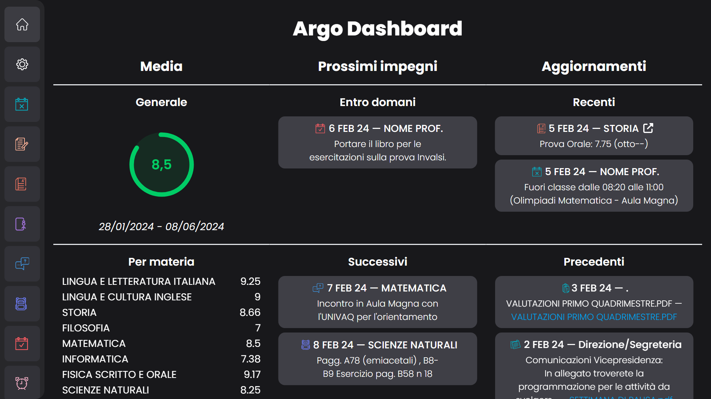

# [Argo Dashboard](https://argo-dashboard.vercel.app)

Una dashboard compatta, sicura e di facile utilizzo per gestire il registro elettronico Argo (didUP).

## Funzionalità

Visualizza in modo compatto ciò che conta.
Mostra la media generale e per materia, nonché i prossimi impegni come compiti, promemoria, attività programmate e ricevimenti.

## Sicurezza

Per accedere ai dati del registro utilizziamo [portaleargo-api](https://github.com/DTrombett/portaleargo-api), un package open source (sviluppato sempre da noi) che pone la sicurezza al primo posto.
Le credenziali vengono inviate al server solo per il primo accesso e non vengono salvate in alcun modo, dopodiché tutto viene eseguito direttamente sul vostro browser in modo da garantire la massima affidabilità.

Tutto il codice del sito e del server è, comunque, disponibile in questa repository per permettere a tutti di proporre modifiche.
In particolare, potete trovare la parte relativa al server in [app/actions.ts](app/actions.ts#L39-L53) e quella riguardo l'accesso sul browser in [components/LoginForm.tsx](components/LoginForm.tsx#L25-L39).

## Come contribuire

Se hai in mente un'idea fantastica per il sito, qualcosa da aggiungere o hai semplicemente trovato un bug, non esitare a segnalarlo!
Se non sei sicuro riguardo l'implementazione, puoi [creare un issue](https://docs.github.com/en/issues/tracking-your-work-with-issues/creating-an-issue) e descrivere ciò che hai in mente.

Sai già come modificare il codice? Allora consulta le [Contribution Guidelines](CONTRIBUTING.md) per le istruzioni su come inviare le tue modifiche!

## Compatibilità

Il sito è compatibile con tutti i principali browser e dispositivi.
Il layout si adatta benissimo alla grandezza del dispositivo mostrando i dati in colonna sui dispositivi più piccoli, come smartphone, e organizzati similmente ad una tabella su dispositivi più grandi, come PC.

---

### Disclaimer

Questo sito non è legato in alcun modo alla società **Argo Software Srl** che fornisce i servizi per il registro elettronico.
Per qualsiasi problema riscontrato durante l'utilizzo dei servizi Argo è, quindi, necessario contattare la loro assistenza tecnica.
È possibile consultare tutti i dettagli riguardo Argo Software sul [loro sito ufficiale](https://argosoft.it).
